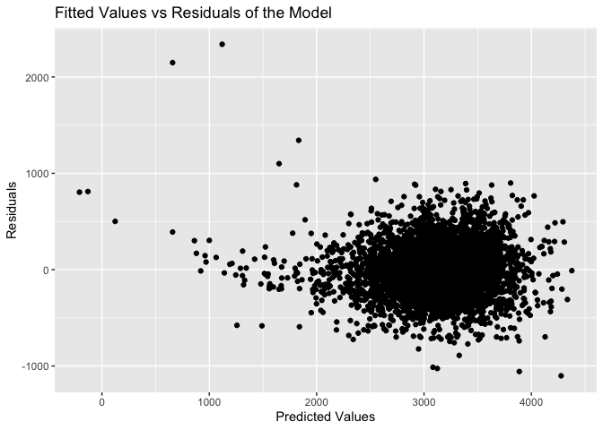
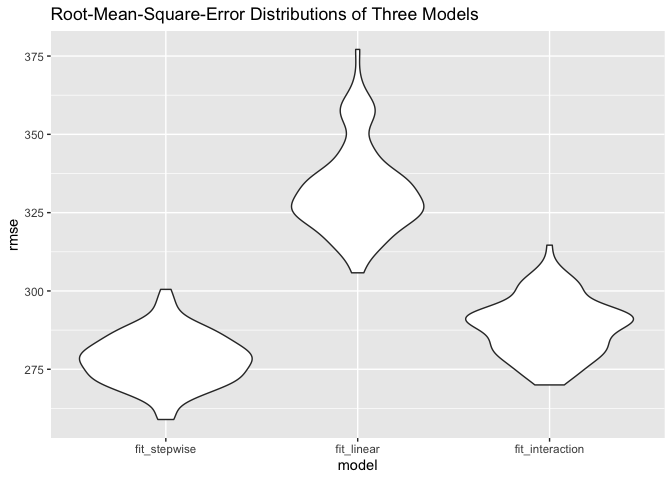
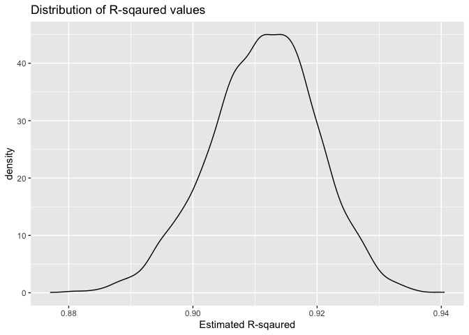
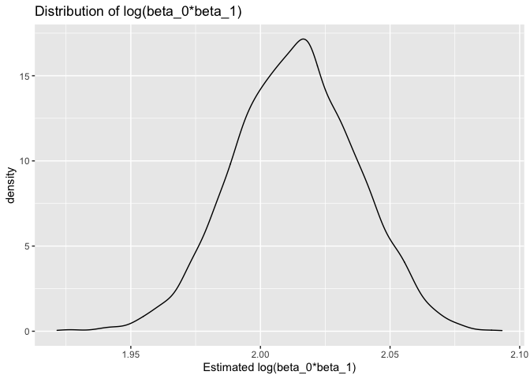

p8105\_hw6\_pz2281
================
Peilin Zhou

``` r
library(tidyverse)
library(modelr)
library(mgcv)
library(ggplot2)
```

## Problem 1

Import data for modelling

``` r
birth_data = read.csv("./data/birthweight.csv") %>%
  as_tibble()
```

Clean the data. First check if there are missing values.

``` r
birth_data %>% 
  summarise_all(~ sum(is.na(.)))
```

    ## # A tibble: 1 × 20
    ##   babysex bhead blength   bwt delwt fincome frace gaweeks malform menarche
    ##     <int> <int>   <int> <int> <int>   <int> <int>   <int>   <int>    <int>
    ## 1       0     0       0     0     0       0     0       0       0        0
    ## # … with 10 more variables: mheight <int>, momage <int>, mrace <int>,
    ## #   parity <int>, pnumlbw <int>, pnumsga <int>, ppbmi <int>, ppwt <int>,
    ## #   smoken <int>, wtgain <int>

``` r
#no missing values


birth_data %>% 
  select(babysex, frace, mrace, malform) %>% 
  summarise_all(list(~n_distinct(.)))
```

    ## # A tibble: 1 × 4
    ##   babysex frace mrace malform
    ##     <int> <int> <int>   <int>
    ## 1       2     5     4       2

``` r
#clean the data

clean_birth = birth_data %>% 
  mutate_at(c("babysex", "frace", "malform", "mrace"), as.factor) %>% 
  mutate_if(is.integer, as.double) 
#  rename(baby_sex = babysex, baby_head = bhead, baby_length = blength, baby_weight = bweight, m_del)
```

To select independent variables for the model, I used scatter plots to
observe the potential association between birth weight and other
variables.

Plots for birth weight against numerical variables:

``` r
clean_birth %>%
  select_if(is.numeric) %>% 
  gather(-bwt, key = "var", value = "value") %>% 
  ggplot(aes(x = value, y = bwt)) +
    geom_point() +
    geom_smooth(method = lm, se = FALSE) +
    facet_wrap(~ var, scales = "free") +
    theme_bw() +
    labs(
    title = "Scatter Plots of Birth Weight Against Other Numeric Variables",
    x = "Numeric Variables",
    y = "Birth Weight"
    )
```

    ## `geom_smooth()` using formula 'y ~ x'

<!-- -->

From the plots, it can be observed that positive associations
potentially exist between birth weight and baby’s head circumference at
birth, baby’s length at birth, gestational age in weeks, mother’s height
gain during pregnancy. These variables can be selected as predictors of
the model.

Plots for birth weight against categorical variables.

``` r
clean_birth %>%
  select_at(c("bwt", "babysex", "frace", "malform", "mrace")) %>% 
  gather(-bwt, key = "var", value = "value") %>% 
  ggplot(aes(x = value, y = bwt)) +
    geom_point() +
    geom_smooth(method = lm, se = FALSE) +
    facet_wrap(~ var, scales = "free") +
    theme_bw() +
  labs(
    title = "Scatter Plots of Birth Weight Against Other Categorical Variables",
    x = "Categorical Variables",
    y = "Birth Weight"
  )
```

    ## Warning: attributes are not identical across measure variables;
    ## they will be dropped

    ## `geom_smooth()` using formula 'y ~ x'

<!-- -->

From the scatter plots, there is no clear relationship between birth
weight and other categorical variables, but a visually noticeable
difference in birth weight does exists based on father/mother’s race, or
the presence of malformations.

Based on the above observations, my hypothesized model contains 5
numeric variables and 2 categorical variables which have shown potential
relationship with birth weight.

Hypothesized Model:

bwt = bhead + blength + delwt + gaweeks + wtgain + frace + mrace

``` r
my_fit = lm(bwt ~ bhead + blength + gaweeks + wtgain + frace + mrace, data = clean_birth)
broom::glance(my_fit) %>% knitr::kable()
```

| r.squared | adj.r.squared |    sigma | statistic | p.value |  df |    logLik |      AIC |      BIC |  deviance | df.residual | nobs |
|----------:|--------------:|---------:|----------:|--------:|----:|----------:|---------:|---------:|----------:|------------:|-----:|
| 0.7070168 |     0.7062725 | 277.5703 |  949.9093 |       0 |  11 | -30583.44 | 61192.87 | 61275.76 | 333606017 |        4330 | 4342 |

``` r
broom::tidy(my_fit) %>% knitr::kable()
```

| term        |     estimate |  std.error |   statistic |   p.value |
|:------------|-------------:|-----------:|------------:|----------:|
| (Intercept) | -5715.406645 | 98.2067089 | -58.1977210 | 0.0000000 |
| bhead       |   133.139984 |  3.4526125 |  38.5620991 | 0.0000000 |
| blength     |    78.052461 |  2.0353113 |  38.3491505 | 0.0000000 |
| gaweeks     |    11.363394 |  1.4767478 |   7.6948780 | 0.0000000 |
| wtgain      |     3.642644 |  0.3951349 |   9.2187351 | 0.0000000 |
| frace2      |    32.269060 | 46.8486191 |   0.6887943 | 0.4909896 |
| frace3      |    34.073029 | 70.5180429 |   0.4831817 | 0.6289911 |
| frace4      |   -28.960171 | 45.3949023 |  -0.6379609 | 0.5235329 |
| frace8      |   -14.162578 | 75.3159130 |  -0.1880423 | 0.8508523 |
| mrace2      |  -156.115473 | 46.7501785 |  -3.3393557 | 0.0008468 |
| mrace3      |  -122.803277 | 72.9210343 |  -1.6840584 | 0.0922425 |
| mrace4      |   -90.755547 | 45.7139879 |  -1.9852905 | 0.0471751 |

However, I also want to use the step-wise model selection
method(bi-directional) to fit a model and compare it with my
hypothesized model. The one that has higher adjusted *r*<sup>2</sup>
value would be selected as the hypothesized model.

Step-wise model selection:

``` r
fit_intercept = lm(bwt ~ 1, data = clean_birth)
fit_all = lm(bwt ~ ., data = clean_birth)
fit_stepwise = step(fit_intercept, direction = 'both', scope = formula(fit_all), trace = 0)
broom::glance(fit_stepwise) %>% knitr::kable()
```

| r.squared | adj.r.squared |    sigma | statistic | p.value |  df |    logLik |      AIC |      BIC |  deviance | df.residual | nobs |
|----------:|--------------:|---------:|----------:|--------:|----:|----------:|---------:|---------:|----------:|------------:|-----:|
| 0.7180449 |      0.717198 | 272.3591 |  847.8432 |       0 |  13 | -30500.14 | 61030.28 | 61125.92 | 321048783 |        4328 | 4342 |

``` r
broom::tidy(fit_stepwise) %>% knitr::kable()
```

| term        |      estimate |   std.error |  statistic |   p.value |
|:------------|--------------:|------------:|-----------:|----------:|
| (Intercept) | -5683.3155772 | 101.3383179 | -56.082592 | 0.0000000 |
| bhead       |   130.8391142 |   3.4469781 |  37.957629 | 0.0000000 |
| blength     |    74.9782841 |   2.0189603 |  37.137078 | 0.0000000 |
| mrace2      |  -138.8296943 |   9.9081639 | -14.011647 | 0.0000000 |
| mrace3      |   -76.3487944 |  42.3170414 |  -1.804209 | 0.0712680 |
| mrace4      |  -101.7777320 |  19.2911129 |  -5.275887 | 0.0000001 |
| delwt       |     4.1085711 |   0.3921208 |  10.477818 | 0.0000000 |
| gaweeks     |    11.5806032 |   1.4621587 |   7.920209 | 0.0000000 |
| smoken      |    -4.8442918 |   0.5856566 |  -8.271557 | 0.0000000 |
| ppbmi       |    -9.2218922 |   2.5770942 |  -3.578407 | 0.0003495 |
| babysex2    |    28.5570040 |   8.4560136 |   3.377124 | 0.0007389 |
| parity      |    95.8951528 |  40.3393656 |   2.377210 | 0.0174874 |
| ppwt        |    -1.0679341 |   0.5677476 |  -1.881001 | 0.0600388 |
| fincome     |     0.3229627 |   0.1746923 |   1.848751 | 0.0645619 |

As shown in the table, the model fitted using step-wise selection has
higher *r*<sup>2</sup> value. So the model I would use as hypothesized
model is fit\_stepwise.

Plot of model residuals against fitted values:

``` r
clean_birth %>% 
  modelr::add_residuals(fit_stepwise) %>% 
  modelr::add_predictions(fit_stepwise) %>% 
  ggplot(aes(x = pred, y = resid)) +
  geom_point() +
  labs(
    title = "Fitted Values vs Residuals of the Model",
    y = "Residuals",
    x = "Predicted Values"
  )
```

<!-- -->

Most of the points are symmetrically distributed and clustered around 0
on the y-axis. However, we can see that when the predicted values are
small, the residuals tend to have extreme values.

Next, compare fit\_stepwise model with two prespecified models:

Fit two models:

``` r
fit_linear = lm(bwt ~ blength + gaweeks, data = clean_birth)
broom::tidy(fit_linear) %>% knitr::kable()
```

| term        |    estimate | std.error | statistic | p.value |
|:------------|------------:|----------:|----------:|--------:|
| (Intercept) | -4347.66707 | 97.958360 | -44.38281 |       0 |
| blength     |   128.55569 |  1.989891 |  64.60439 |       0 |
| gaweeks     |    27.04673 |  1.717930 |  15.74379 |       0 |

``` r
broom::glance(fit_linear) %>% knitr::kable()
```

| r.squared | adj.r.squared |    sigma | statistic | p.value |  df |    logLik |      AIC |      BIC |  deviance | df.residual | nobs |
|----------:|--------------:|---------:|----------:|--------:|----:|----------:|---------:|---------:|----------:|------------:|-----:|
| 0.5768894 |     0.5766943 | 333.2174 |  2958.001 |       0 |   2 | -31381.32 | 62770.64 | 62796.14 | 481775846 |        4339 | 4342 |

``` r
fit_interaction = lm(bwt ~ bhead * blength + bhead * babysex + blength * babysex + bhead * babysex * blength, data = clean_birth)
broom::tidy(fit_interaction) %>% knitr::kable()
```

| term                   |      estimate |    std.error |  statistic |   p.value |
|:-----------------------|--------------:|-------------:|-----------:|----------:|
| (Intercept)            | -7176.8170221 | 1264.8397394 | -5.6740920 | 0.0000000 |
| bhead                  |   181.7956350 |   38.0542051 |  4.7772811 | 0.0000018 |
| blength                |   102.1269235 |   26.2118095 |  3.8962180 | 0.0000992 |
| babysex2               |  6374.8683508 | 1677.7669213 |  3.7996150 | 0.0001469 |
| bhead:blength          |    -0.5536096 |    0.7802092 | -0.7095656 | 0.4780117 |
| bhead:babysex2         |  -198.3931810 |   51.0916850 | -3.8830816 | 0.0001047 |
| blength:babysex2       |  -123.7728875 |   35.1185360 | -3.5244319 | 0.0004288 |
| bhead:blength:babysex2 |     3.8780531 |    1.0566296 |  3.6702106 | 0.0002453 |

``` r
broom::glance(fit_interaction) %>% knitr::kable()
```

| r.squared | adj.r.squared |    sigma | statistic | p.value |  df |   logLik |      AIC |      BIC |  deviance | df.residual | nobs |
|----------:|--------------:|---------:|----------:|--------:|----:|---------:|---------:|---------:|----------:|------------:|-----:|
|  0.684876 |      0.684367 | 287.7344 |  1345.616 |       0 |   7 | -30741.6 | 61501.19 | 61558.58 | 358816655 |        4334 | 4342 |

Compare the models and plot the RMSE distributions:

``` r
set.seed(1)
cv_df = crossv_mc(clean_birth,100) %>% 
  mutate(
    train = map(train, as_tibble),
    test = map(test, as_tibble)
  ) %>% 
  mutate(
    fit_stepwise = map(train, ~lm(bwt ~ bhead + blength + gaweeks + wtgain + frace + mrace, data = .x)),
    fit_linear = map(train, ~lm(bwt ~ blength + gaweeks, data = .x)),
    fit_interaction = map(train, ~lm(bwt ~ bhead * blength + bhead * babysex + blength * babysex + bhead * babysex * blength, data = .x))
  ) %>% 
  mutate(
    rmse_fit_stepwise = map2_dbl(fit_stepwise, test, ~rmse(model = .x, data = .y)),
    rmse_fit_linear    = map2_dbl(fit_linear, test, ~rmse(model = .x, data = .y)),
    rmse_fit_interaction    = map2_dbl(fit_interaction, test, ~rmse(model = .x, data = .y)),
  )

cv_df %>% 
  select(starts_with("rmse")) %>% 
  pivot_longer(
    everything(),
    names_to = "model", 
    values_to = "rmse",
    names_prefix = "rmse_") %>% 
  mutate(model = fct_inorder(model)) %>% 
  ggplot(aes(x = model, y = rmse)) + geom_violin() +
  labs(
    title = "Root-Mean-Square-Error Distributions of Three Models"
  )
```

<!-- -->

Based on the distributions of RMSE values from the three models, we can
clearly see that the model with the fewest predictors, in other words,
the fit\_linear model performs the worst. And the hypothesized model,
fit\_stepwise, performs better than the one with interactions, but there
is some overlap between the two distributions of rmse of these two
models. So, it might be better to compute the average rmse to have
clearer picture:

``` r
cv_df %>% 
  select(starts_with("rmse")) %>% 
  pivot_longer(
    everything(),
    names_to = "model", 
    values_to = "rmse",
    names_prefix = "rmse_") %>% 
  mutate(model = fct_inorder(model)) %>% 
  group_by(model) %>% 
  summarise(
    avg_rmse = mean(rmse)
  ) %>% knitr::kable()
```

| model            | avg\_rmse |
|:-----------------|----------:|
| fit\_stepwise    |  278.1925 |
| fit\_linear      |  332.2287 |
| fit\_interaction |  288.6030 |

Now, it is obvious that the average rmse is lowest for the hypothesized
model(fit\_stepwise). This model performs best comparing to the other
two models.

## Problem 2

Importing the data

``` r
weather_df = 
  rnoaa::meteo_pull_monitors(
    c("USW00094728"),
    var = c("PRCP", "TMIN", "TMAX"), 
    date_min = "2017-01-01",
    date_max = "2017-12-31") %>%
  mutate(
    name = recode(id, USW00094728 = "CentralPark_NY"),
    tmin = tmin / 10,
    tmax = tmax / 10) %>%
  select(name, id, everything())
```

    ## Registered S3 method overwritten by 'hoardr':
    ##   method           from
    ##   print.cache_info httr

    ## using cached file: ~/Library/Caches/R/noaa_ghcnd/USW00094728.dly

    ## date created (size, mb): 2021-10-12 16:05:15 (7.604)

    ## file min/max dates: 1869-01-01 / 2021-10-31

Bootstrapping the data:

``` r
bs_weather = weather_df %>% 
  bootstrap(n = 5000) %>% 
  mutate(fit = map(strap, ~lm(tmax ~ tmin, data = .x))) %>% 
  mutate(results = map(fit, broom::tidy)) %>% 
  mutate(results_2 = map(fit, broom::glance))
```

Making density plots and obtaining 95% confidence intervals for
*r̂*<sup>2</sup> and estimated log(beta\_0 \* beta\_1).

``` r
#Density plot for R^2 values
bs_weather %>% 
  unnest(results_2) %>% 
  select(r.squared) %>% 
  ggplot(aes(x = r.squared)) + 
  geom_density() +
  labs(
    title = "Distribution of R-sqaured values",
    x = "Estimated R-sqaured"
  )
```

<!-- -->

Under repeated sampling of the weather data, the distribution of
estimated *R*<sup>2</sup> values of the fitted model is approximately
normal and centered around 0.91.

95% confidence interval of estimated *R*<sup>2</sup>:

``` r
#Obtaining 95% confidence interval for R^2 estimates
bs_weather %>% 
  unnest(results_2) %>% 
  select(r.squared) %>% 
  summarise(
    ci_lower = quantile(r.squared, 0.025),
    ci_higher = quantile(r.squared, 0.975)
  ) %>% knitr::kable()
```

| ci\_lower | ci\_higher |
|----------:|-----------:|
| 0.8936977 |  0.9274807 |

Distribution of estimated log(beta\_0 \* beta\_1):

``` r
beta_bs_weather = bs_weather %>%   
  select(-strap, -fit, -results_2) %>% 
  unnest(results) %>% 
  select(.id, term, estimate) %>% 
  pivot_wider(
    names_from = term, 
    values_from = estimate
  ) %>% 
  rename(
    id = .id, beta_0 = `(Intercept)`, beta_1 = tmin
  ) %>% 
  mutate(log_multiples = log(beta_0*beta_1))

#density plot for log(beta_0 * beta_1)
beta_bs_weather %>% 
  ggplot(aes(x = log_multiples)) +
  geom_density() +
  labs(
    title = "Distribution of log(beta_0*beta_1)",
    x = "Estimated log(beta_0*beta_1)"
  )
```

<!-- -->

Under repeated sampling, the value of estimated log(beta\_0 \* beta\_1)
is centered around 2 to 2.025. And there is a slightly longer tail on
the left, indicating having lower estimated values occasionally.

95% confidence interval for estimated log(beta\_0 \* beta\_1):

``` r
beta_bs_weather %>% 
  summarise(
    ci_lower = quantile(log_multiples, 0.025),
    ci_higher = quantile(log_multiples, 0.975)
  ) %>% knitr::kable()
```

| ci\_lower | ci\_higher |
|----------:|-----------:|
|  1.966942 |   2.058528 |
