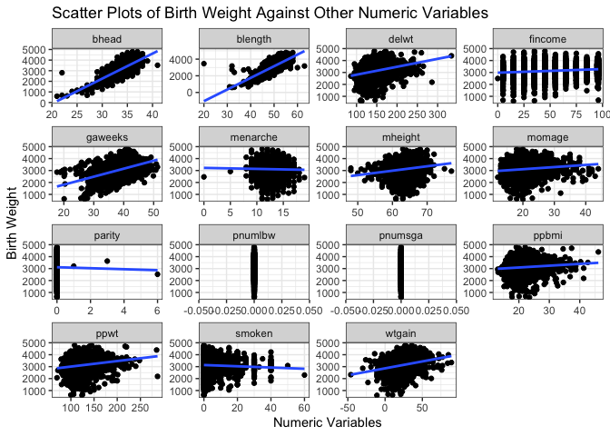
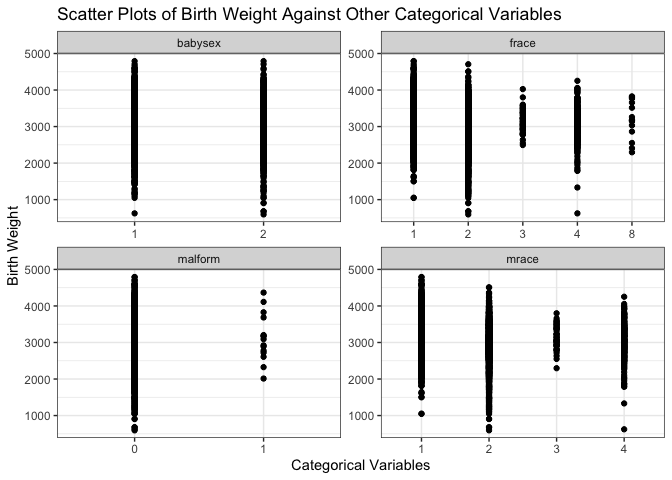

p8105\_hw6\_pz2281
================
Peilin Zhou

``` r
library(tidyverse)
library(modelr)
library(mgcv)
library(ggplot2)
```

## Problem 1

Import data for modelling

``` r
birth_data = read.csv("./data/birthweight.csv") %>%
  as_tibble()
```

Clean the data. First check if there are missing values.

``` r
birth_data %>% 
  summarise_all(~ sum(is.na(.)))
```

    ## # A tibble: 1 × 20
    ##   babysex bhead blength   bwt delwt fincome frace gaweeks malform menarche
    ##     <int> <int>   <int> <int> <int>   <int> <int>   <int>   <int>    <int>
    ## 1       0     0       0     0     0       0     0       0       0        0
    ## # … with 10 more variables: mheight <int>, momage <int>, mrace <int>,
    ## #   parity <int>, pnumlbw <int>, pnumsga <int>, ppbmi <int>, ppwt <int>,
    ## #   smoken <int>, wtgain <int>

``` r
#no missing values


birth_data %>% 
  select(babysex, frace, mrace, malform) %>% 
  summarise_all(list(~n_distinct(.)))
```

    ## # A tibble: 1 × 4
    ##   babysex frace mrace malform
    ##     <int> <int> <int>   <int>
    ## 1       2     5     4       2

``` r
#clean the data

clean_birth = birth_data %>% 
  mutate_at(c("babysex", "frace", "malform", "mrace", "fincome"), as.factor) %>% 
  mutate_if(is.integer, as.double) 
#  rename(baby_sex = babysex, baby_head = bhead, baby_length = blength, baby_weight = bweight, m_del)
```

To select independent variables for the model, I used scatter plots to
observe the potential association between birth weight and other
variables.

Plots for birth weight against numerical variables:

``` r
clean_birth %>%
  select_if(is.numeric) %>% 
  gather(-bwt, key = "var", value = "value") %>% 
  ggplot(aes(x = value, y = bwt)) +
    geom_point() +
    geom_smooth(method = lm, se = FALSE) +
    facet_wrap(~ var, scales = "free") +
    theme_bw() +
    labs(
    title = "Scatter Plots of Birth Weight Against Other Numeric Variables",
    x = "Numeric Variables",
    y = "Birth Weight"
    )
```

    ## `geom_smooth()` using formula 'y ~ x'

<!-- -->

From the plots, it can be observed that positive associations
potentially exist between birth weight and baby’s head circumference at
birth, baby’s length at birth, gestational age in weeks, mother’s height
gain during pregnancy. These variables can be selected as predictors of
the model.

Plots for birth weight against categorical variables.

``` r
clean_birth %>%
  select_at(c("bwt", "babysex", "frace", "malform", "mrace")) %>% 
  gather(-bwt, key = "var", value = "value") %>% 
  ggplot(aes(x = value, y = bwt)) +
    geom_point() +
    geom_smooth(method = lm, se = FALSE) +
    facet_wrap(~ var, scales = "free") +
    theme_bw() +
  labs(
    title = "Scatter Plots of Birth Weight Against Other Categorical Variables",
    x = "Categorical Variables",
    y = "Birth Weight"
  )
```

    ## Warning: attributes are not identical across measure variables;
    ## they will be dropped

    ## `geom_smooth()` using formula 'y ~ x'

<!-- -->
